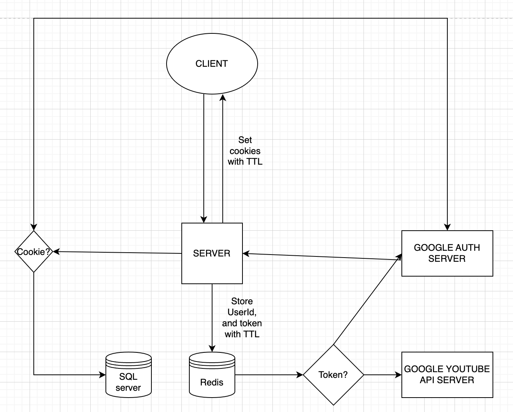

$ go get golang.org/x/oauth2

$ go get golang.org/x/oauth2/google

<<<<<<< HEAD

## System plan examplanation
1. The users use session to communicate with server
2. The server will use JWT tokens, to communicate with other service APIs
3. The server will use Redis to store the session data / JWT tokens(mapping with the sessionIDs)
4. The server will use MySQL to store the user data

Reasons for the design:
1. I want the system to be stateless and wanted to compose them into microservices, so scaling stays easy
2. for previous purpose I mentioned (1), I thought using jWT tokens would be a good idea.
3. to use JWT tokens, I had to find out a way to make the system more secure as JWT tokens never go invalid(technically you can extract user information from expired JWT tokens as it stll has not encrypted data but just encoded).
4. So I came to the conclusion, using sessions with users, but internally using JWT tokens for other service APIs.
5. to make the system fast, I decided to use Redis for fetching JWT tokens.

=======
## System plan

>>>>>>> master
